<h2>TensorFlow-FlexUNet-Image-Segmentation-MSD-Hippocampus (2026/03/04)</h2>
Sarah T.  Arai 
Software Laboratory antillia.com  
This is the first experiment of Image Segmentation for <b>Medical Segmentation Decathlon (MSD) Hippocampus MRI </b> based on our <a href="./src/TensorFlowFlexUNet.py">TensorFlowFlexUNet</a> 
(TensorFlow Flexible UNet Image Segmentation Model for Multiclass), 
and a 512x512 pixels PNG 
<a href="https://drive.google.com/file/d/164_VJsNF16wvDgVfZr1mOeGLg4yW_L8J/view?usp=sharing">
<b>MSD-Hippocampus-ImageMask-Dataset.zip</b></a> which was derived by us from   
<a href="https://www.kaggle.com/datasets/andrewmvd/hippocampus-segmentation-in-mri-images">
<b>Hippocampus Segmentation in MRI Images</b> </a> on the kaggle.com.
   

<b>Actual Image Segmentation for Hippocampus Images of  512x512 pixels </b> 
As shown below, the inferred masks predicted by our segmentation model trained by the dataset appear similar to the ground truth masks.
  
<table>
<tr>
<th>Input: image</th>
<th>Mask (ground_truth)</th>
<th>Prediction: inferred_mask</th>
</tr>
<tr>
<td>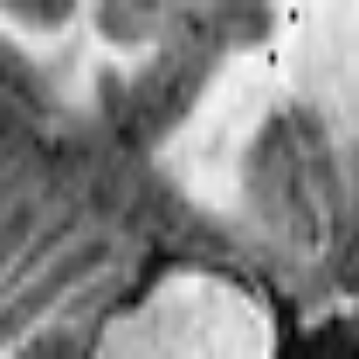</td>
<td></td>
<td></td>
</tr>

<tr>
<td>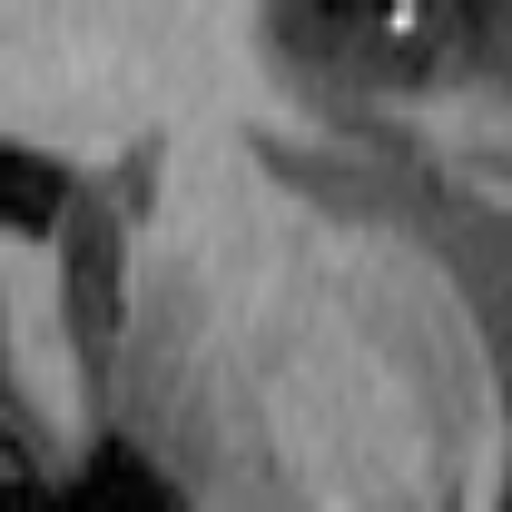</td>
<td></td>
<td></td>
</tr>

<tr>
<td>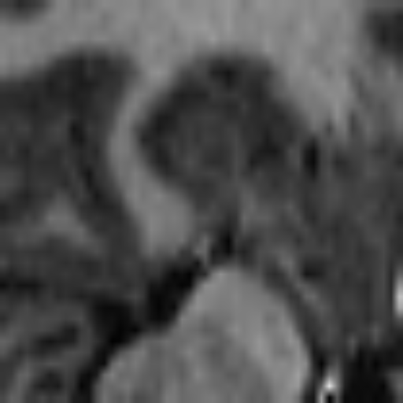</td>
<td></td>
<td>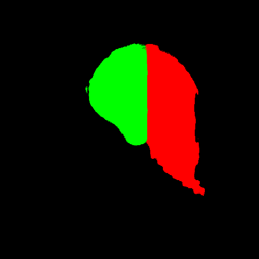</td>
</tr>
</table>

 
<h3>1  Dataset Citation</h3>
The dataset used here was derived from   
<a href="https://drive.google.com/drive/folders/1HqEgzS8BV2c7xYNrZdEAnrHk7osJJ--2">
<b>Task04_Hippocampus.tar</b> </a>  
<b></b> 
on <a href="http://medicaldecathlon.com/">Medical Segmentation Decathlon</a>.
  
For more information, please refer to <a href="https://arxiv.org/pdf/1902.09063">
A large annotated medical image dataset for the development and evaluation of segmentation algorithms
</a>  
<b>Data</b> 
<b>All data will be made available online with a permissive copyright-license (CC-BY-SA 4.0), 
allowing for data to be shared, distributed and improved upon</b>.  
All data has been labeled and verified by an expert human rater, and with the best effort to mimic the accuracy required 
for clinical use. To cite this data, please refer to <a href="https://arxiv.org/abs/1902.09063">https://arxiv.org/abs/1902.09063</a>
  
The following explanation on the Task04_Hippocampus dataset  was taken from 
<a href="https://github.com/openmedlab/Awesome-Medical-Dataset/blob/main/resources/MSD_Hippocampus.md">
MSD_Hippocampus.md
</a>
  
<b>Dataset Information</b> 
The MSD Hippocampus dataset is Task04, the fourth subtask, of the Medical Segmentation Decathlon (MSD), 
which aims to segment the hippocampal region from single-modality MR images. 
MSD selected this dataset due to the challenge of "high-precision segmentation of two adjacent small structures".  
The dataset includes MR images of 394 patients, officially divided into 263 training cases and 131 test cases, with the test cases available 
for submitting segmentation results for evaluation via the official website. 
 Notably, the actual downloaded training set contains 260 cases, and the test set contains 130 cases.
  
The hippocampus is a key structure in the brain, playing a critical role in functions such as memory formation, spatial navigation, and emotion processing. 
The hippocampus can be divided into anterior and posterior parts based on its anatomical location, with functional differences reflected in their 
respective unique cognitive and emotional processing capabilities.  
The anterior hippocampus is more involved in emotional responses and specific types of memory processing, such as episodic memory, 
while the posterior hippocampus is more related to spatial memory and navigational functions. In clinical diagnosis and neurological disease 
research, accurate segmentation of these two parts is crucial.  
Using Magnetic Resonance Imaging (MRI) technology, not only can 
the overall structure of the hippocampus be clearly observed, but the specific functions of its anterior and posterior parts can also be analyzed in detail. 
 This is vital for the study and treatment of diseases related to hippocampal dysfunction, such as Alzheimer's disease and epilepsy. 
 Through precise segmentation and analysis of different parts of the hippocampus, 
doctors and researchers can gain a deeper understanding of the pathogenesis of these diseases and develop more effective diagnostic and treatment strategies.
  
<b>Labels</b> 
The mask of this dataset contains two label: anterior part and posterior part of the hippocampus.
  
<b>Authors and Institutions</b> 
Bennett Landman(Vanderbilt University, United States)
  
<b>Citation</b> 
<pre>
@article{antonelli2022medical,
  title={The Medical Segmentation Decathlon},
  author={Antonelli, Michela and Reinke, Annika and Bakas, Spyridon and others},
  journal={Nature Communications},
  year={2022}, 
  doi={10.1038/s41467-022-30695-9}
}

@misc{simpson2019large,
      title={A large annotated medical image dataset for the development and evaluation of segmentation algorithms}, 
      author={Amber L. Simpson and Michela Antonelli and Spyridon Bakas and Michel Bilello and Keyvan Farahani and Bram van Ginneken and Annette Kopp-Schneider and Bennett A. Landman and Geert Litjens and Bjoern Menze and Olaf Ronneberger and Ronald M. Summers and Patrick Bilic and Patrick F. Christ and Richard K. G. Do and Marc Gollub and Jennifer Golia-Pernicka and Stephan H. Heckers and William R. Jarnagin and Maureen K. McHugo and Sandy Napel and Eugene Vorontsov and Lena Maier-Hein and M. Jorge Cardoso},
      year={2019},
      eprint={1902.09063},
      archivePrefix={arXiv},
      primaryClass={cs.CV}
}
</pre>
 
Original introduction article is <a href="https://zhuanlan.zhihu.com/p/667516333">here</a>.
 

 
<h3>
2 Hippocampus ImageMask Dataset
</h3>
 If you would like to train this Hippocampus Segmentation model by yourself,
please down load our dataset <a href="https://drive.google.com/file/d/164_VJsNF16wvDgVfZr1mOeGLg4yW_L8J/view?usp=sharing">
<b>MSD-Hippocampus-ImageMask-Dataset.zip</b>
</a> on the google drive, expand the downloaded, and put it under <b>./dataset/</b> to be.
<pre>
./dataset
└─Hippocampus
    ├─test
    │   ├─images
    │   └─masks
    ├─train
    │   ├─images
    │   └─masks
    └─valid
        ├─images
        └─masks
</pre>

 
<b>Hippocampus Statistics</b> 
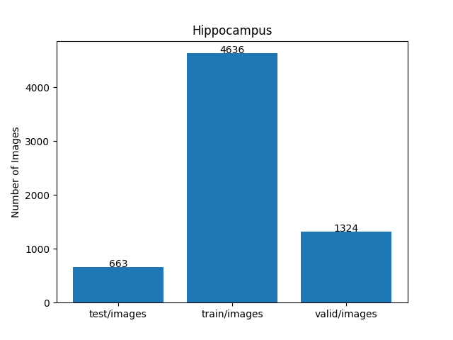 
 
As shown above, the number of images of train and valid datasets is large enough to use for a training set of our segmentation model.
  

<b>Train_images_sample</b> 
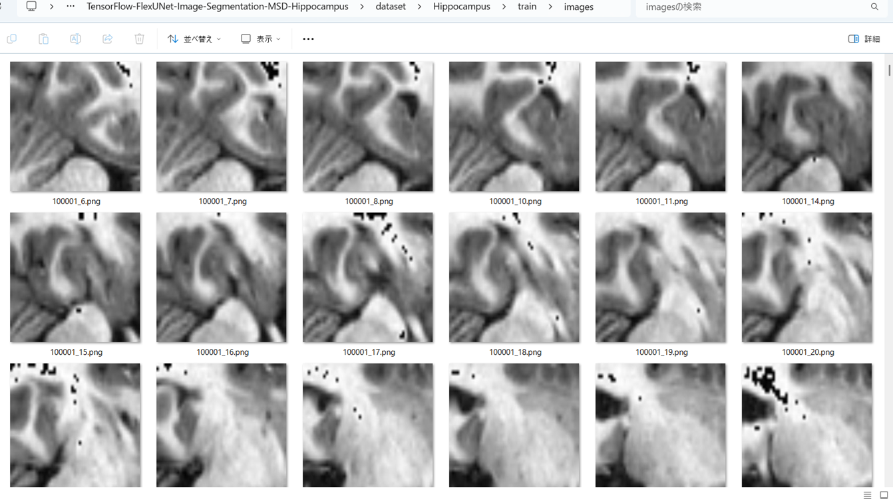
 
<b>Train_masks_sample</b> 
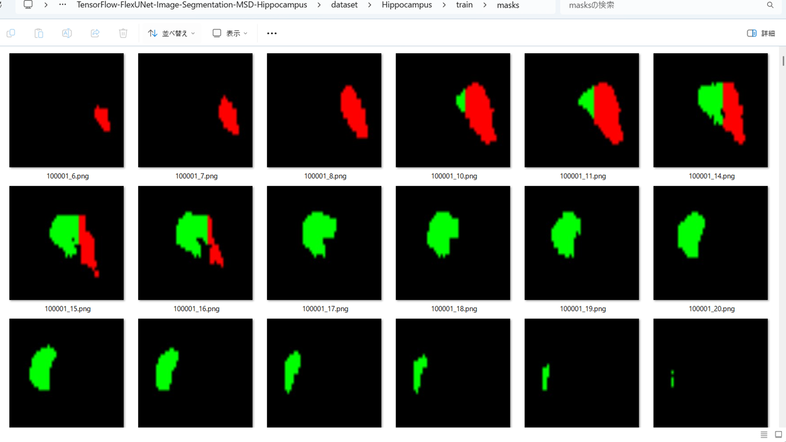
 
<h3>
3 Train TensorflowFlexUNet Model
</h3>
 We trained Hippocampus TensorflowFlexUNet Model by using the following
<a href="./projects/TensorFlowFlexUNet/Hippocampus/train_eval_infer.config"> <b>train_eval_infer.config</b></a> file.  
Please move to ./projects/TensorFlowFlexUNet/Hippocampus, and run the following bat file. 
<pre>
>1.train.bat
</pre>
, which simply runs the following command. 
<pre>
>python ../../../src/TensorFlowFlexUNetTrainer.py ./train_eval_infer.config
</pre>

<b>Model parameters</b> 
Defined a small <b>base_filters=16</b> and a large <b>base_kernels=(11,11)</b> for the first Conv Layer of Encoder Block of 
<a href="./src/TensorFlowFlexUNet.py">TensorFlowFlexUNet.py</a> 
and a large num_layers (including a bridge between Encoder and Decoder Blocks).
<pre>
[model]
image_width    = 512
image_height   = 512
image_channels = 3
input_normalize = True
normalization  = False
num_classes    = 3
base_filters   = 16
base_kernels  = (11,11)
num_layers    = 8
dropout_rate   = 0.05
dilation       = (1,1)
</pre>
<b>Learning rate</b> 
Defined a small learning rate.  
<pre>
[model]
learning_rate  = 0.00007
</pre>
<b>Loss and metrics functions</b> 
Specified "categorical_crossentropy" and "dice_coef_multiclass". 
<pre>
[model]
loss           = "categorical_crossentropy"
metrics        = ["dice_coef_multiclass"]
</pre>
<b >Learning rate reducer callback</b> 
Enabled learing_rate_reducer callback, and a small reducer_patience.
<pre> 
[train]
learning_rate_reducer = True
reducer_factor     = 0.5
reducer_patience   = 4
</pre>
<b>Early stopping callback</b> 
Enabled early stopping callback with patience parameter.
<pre>
[train]
patience      = 10
</pre>
<b></b> 
<b>RGB color map</b> 
rgb color map dict for Hippocampus 1+2 classes. 
<pre>
[mask]
mask_file_format = ".png"
;Hippocampus 1+2
rgb_map = {(0,0,0):0, (255,0,0):1, (0,255,0):2}
</pre>
<b>Epoch change inference callbacks</b> 
Enabled epoch_change_infer callback. 
<pre>
[train]
epoch_change_infer       = True
epoch_change_infer_dir   =  "./epoch_change_infer"
epoch_changeinfer        = False
epoch_changeinfer_dir    = "./epoch_changeinfer"
num_infer_images         = 6
</pre>
By using this epoch_change_infer callback, on every epoch_change, the inference procedure can be called
 for 6 images in <b>mini_test</b> folder. This will help you confirm how the predicted mask changes 
 at each epoch during your training process.    
<b>Epoch_change_inference output at starting (1,2,3)</b> 
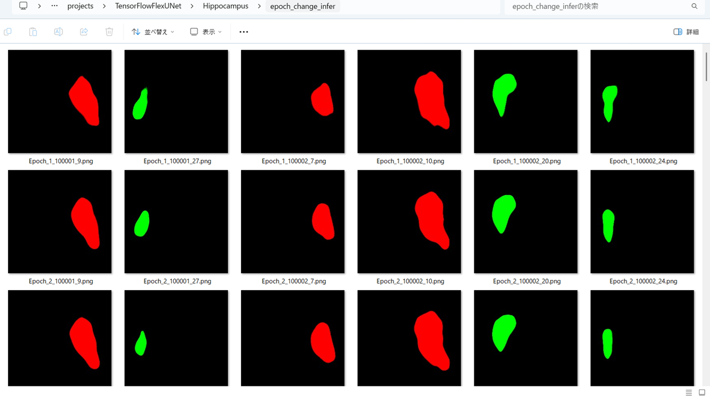 
 
<b>Epoch_change_inference output at middle-point (15,16,17)</b> 
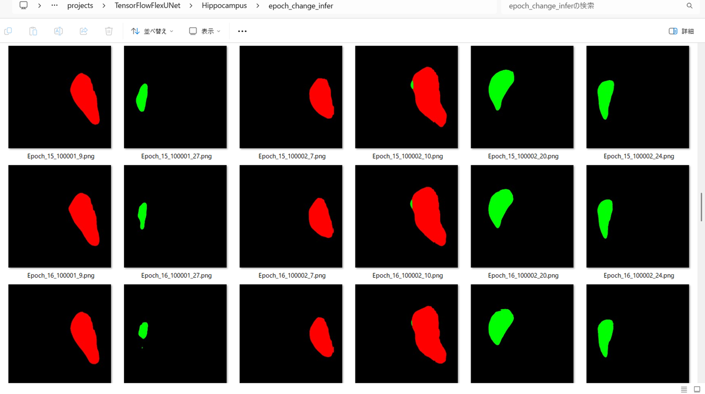 
 
<b>Epoch_change_inference output at ending (30,31,32)</b> 
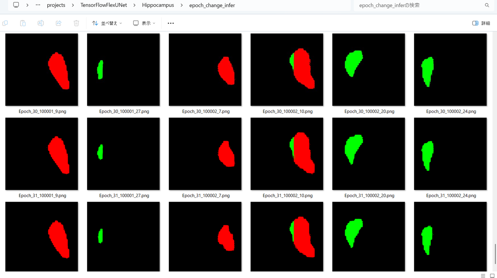 

 
In this experiment, the training process was stopped at epoch 32 by EarlyStoppingCallback.  
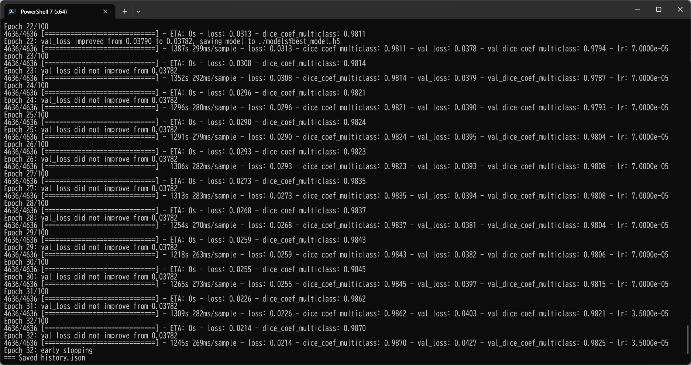 
 
<a href="./projects/TensorFlowFlexUNet/Hippocampus/eval/train_metrics.csv">train_metrics.csv</a> 
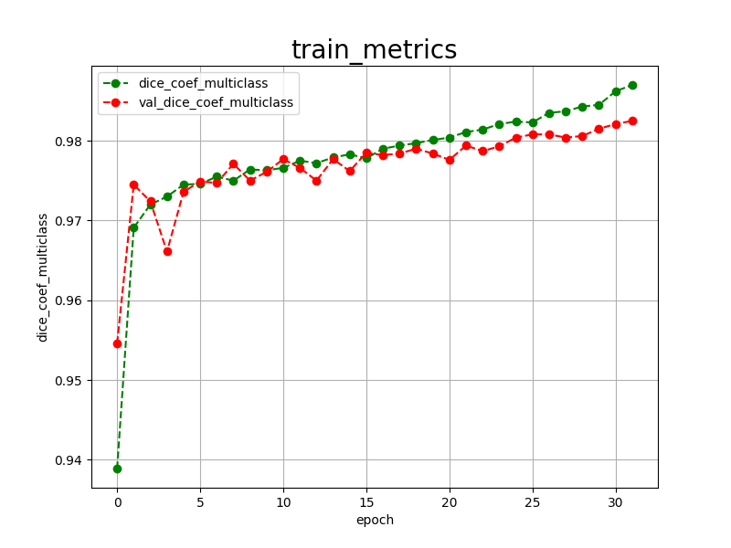 

 
<a href="./projects/TensorFlowFlexUNet/Hippocampus/eval/train_losses.csv">train_losses.csv</a> 
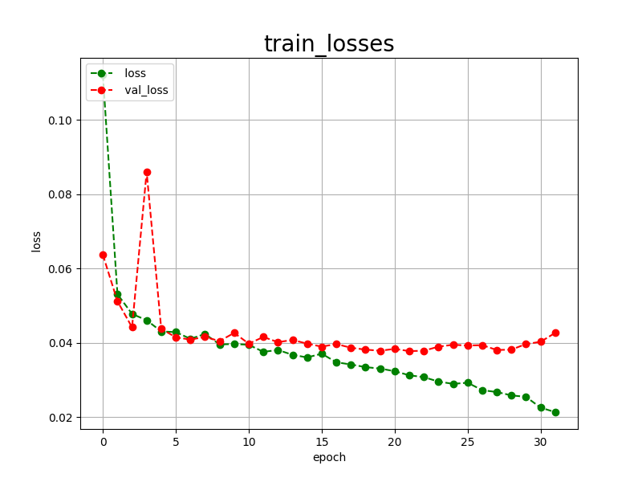 
 
<h3>
4 Evaluation
</h3>
Please move to a <b>./projects/TensorFlowFlexUNet/Hippocampus</b> folder, and run the following bat file to evaluate TensorflowFlexUNet model for Hippocampus. 
<pre>
>./2.evaluate.bat
</pre>
This bat file simply runs the following command.
<pre>
>python ../../../src/TensorFlowFlexUNetEvaluator.py  ./train_eval_infer.config
</pre>
Evaluation console output: 
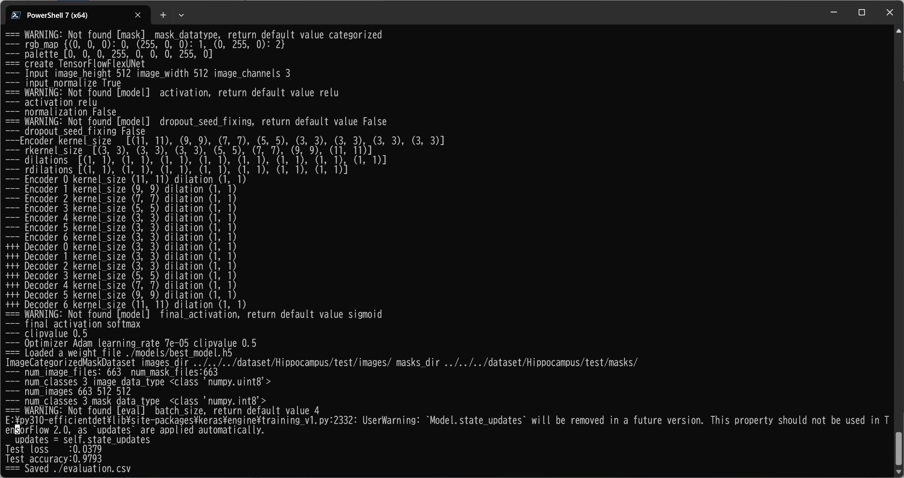
  Image-Segmentation-Hippocampus

<a href="./projects/TensorFlowFlexUNet/Hippocampus/evaluation.csv">evaluation.csv</a> 
The loss (categorical_crossentropy) to this Hippocampus/test was not low, and dice_coef_multiclass not high as shown below.
 
<pre>
categorical_crossentropy,0.0379
dice_coef_multiclass,0.9793
</pre>
 
<h3>5 Inference</h3>
Please move to a <b>./projects/TensorFlowFlexUNet/Hippocampus</b> folder, and run the following bat file to infer segmentation regions for images by the Trained-TensorflowFlexUNet model for Hippocampus. 
<pre>
>./3.infer.bat
</pre>
This simply runs the following command.
<pre>
>python ../../../src/TensorFlowFlexUNetInferencer.py ./train_eval_infer.config
</pre>

<b>mini_test_images</b> 
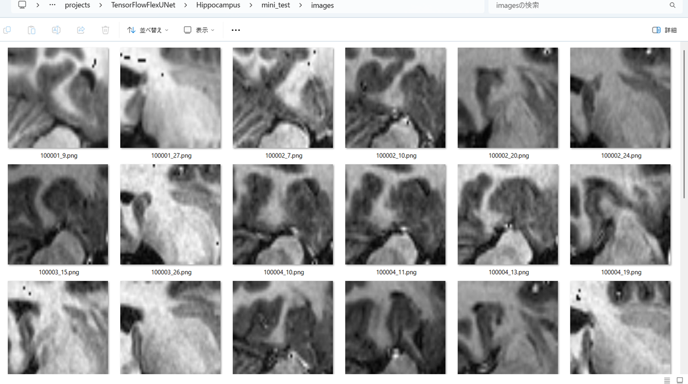 
<b>mini_test_mask(ground_truth)</b> 
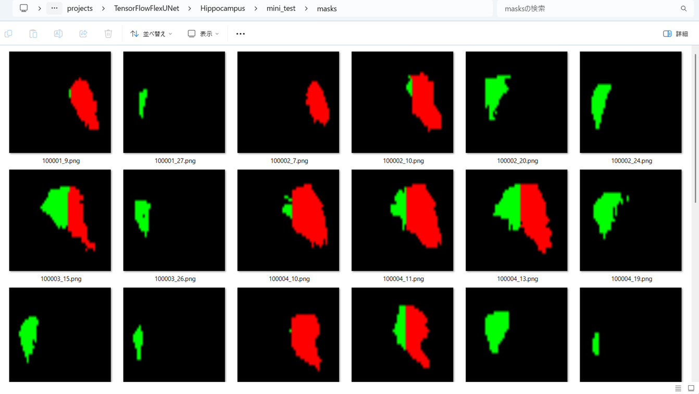 

<b>Inferred test masks</b> 
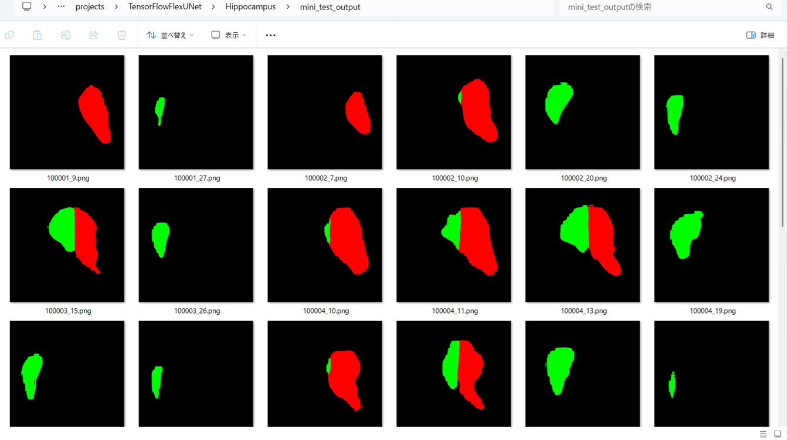 
 

<b>Enlarged images and masks for  Hippocampus  Images of 512x512 pixels</b> 
As shown below, the inferred masks predicted by our segmentation model trained by the dataset appear similar to the ground truth masks.
 
 
<table>
<tr>
<th>Input: image</th>
<th>Mask (ground_truth)</th>
<th>Prediction: inferred_mask</th>
</tr>
<tr>
<td>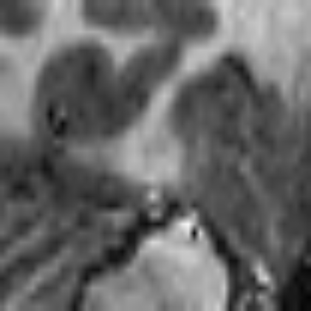</td>
<td></td>
<td>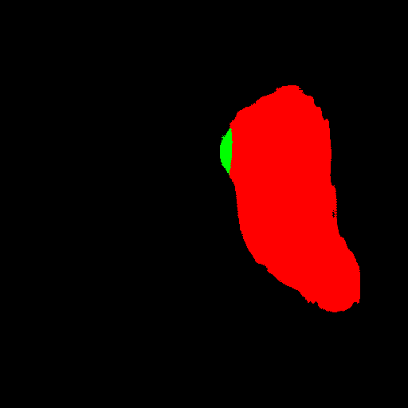</td>
</tr>

<tr>
<td>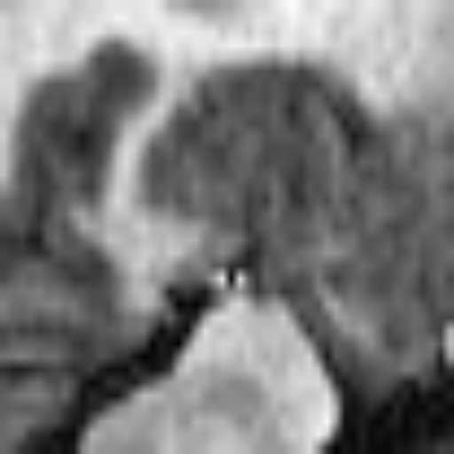</td>
<td></td>
<td>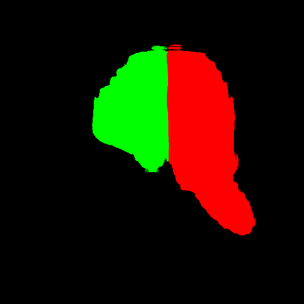</td>
</tr>

<tr>
<td>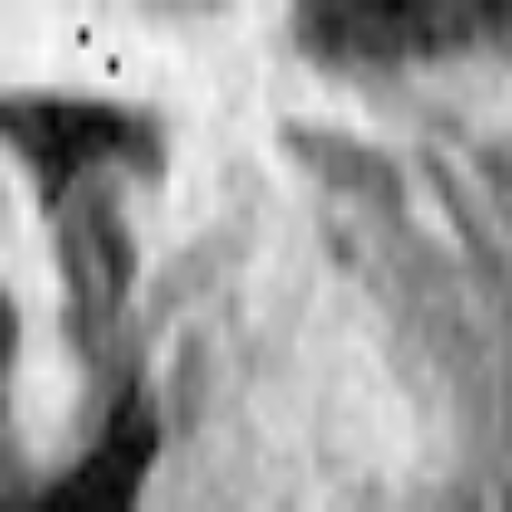</td>
<td></td>
<td>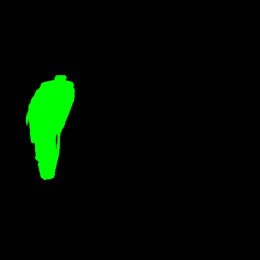</td>
</tr>
<tr>
<td>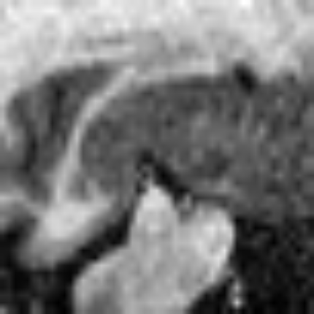</td>
<td></td>
<td>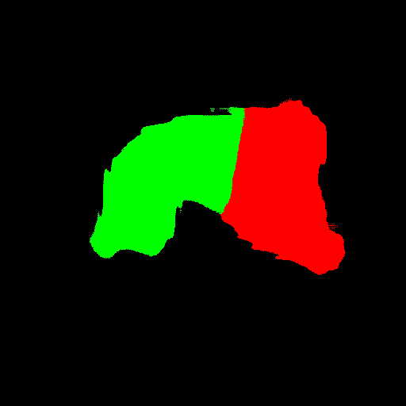</td>
</tr>
<tr>
<td>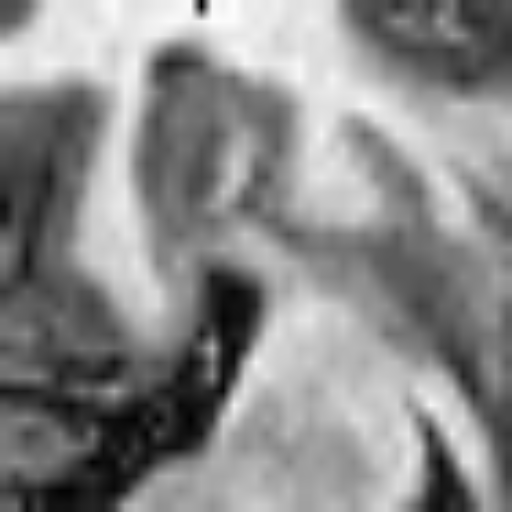</td>
<td></td>
<td>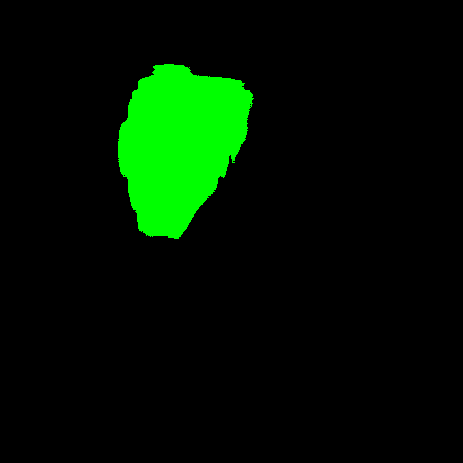</td>
</tr>
<tr>
<td>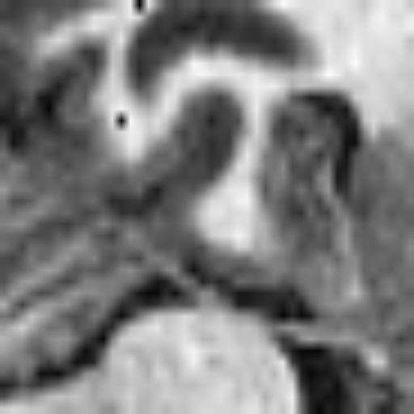</td>
<td></td>
<td>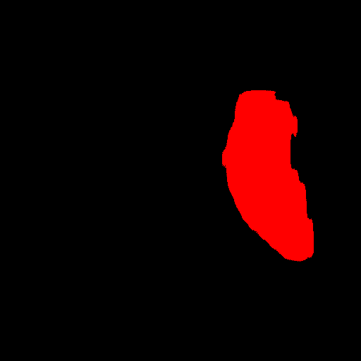</td>
</tr>
</table>

 
<h3>
References
</h3>
<b>1. DATASET OF MAGNETIC RESONANCE IMAGES OF NONEPILEPTIC SUBJECTS AND TEMPORAL LOBE EPILEPSY PATIENTS 
FOR VALIDATION OF HIPPOCAMPAL SEGMENTATION TECHNIQUES</b> 
Kourosh Jafari-Khouzani, Kost V Elisevich, Suresh Patel, Hamid Soltanian-Zadeh  
<a href="https://pmc.ncbi.nlm.nih.gov/articles/PMC4501402/">
https://pmc.ncbi.nlm.nih.gov/articles/PMC4501402/</a>
  
<b>2.  Hippocampus Segmentation Using U-Net Convolutional Network from Brain Magnetic Resonance Imaging (MRI)</b> 
Ruhul Amin Hazarika, Arnab Kumar Maji, Raplang Syiem, Samarendra Nath Sur, Debdatta Kandar  
<a href="https://pmc.ncbi.nlm.nih.gov/articles/PMC9485390/">
https://pmc.ncbi.nlm.nih.gov/articles/PMC9485390/</a>
  
<b>3. Fully Automated Hippocampus Segmentation using T2-informed Deep Convolutional Neural Networks</b> 
Maximilian Sackl, Christian Tinauer, Martin Urschler, Christian Enzinger, Rudolf Stollberger, Stefan Ropele  
<a href="https://www.sciencedirect.com/science/article/pii/S1053811924002647">
https://www.sciencedirect.com/science/article/pii/S1053811924002647</a>
  
<b>4. TensorFlow-FlexUNet-Image-Segmentation-Hippocampus-T1W</b> 
Toshiyuki Arai  
<a href="https://github.com/sarah-antillia/TensorFlow-FlexUNet-Image-Segmentation-Hippocampus-T1W">
https://github.com/sarah-antillia/TensorFlow-FlexUNet-Image-Segmentation-Hippocampus-T1W
</a>
 
 
<b>5. TensorFlow-FlexUNet-Image-Segmentation-Model</b> 
Toshiyuki Arai  
<a href="https://github.com/sarah-antillia/TensorFlow-FlexUNet-Image-Segmentation-Model">
TensorFlow-FlexUNet-Image-Segmentation-Model
</a>
 
 